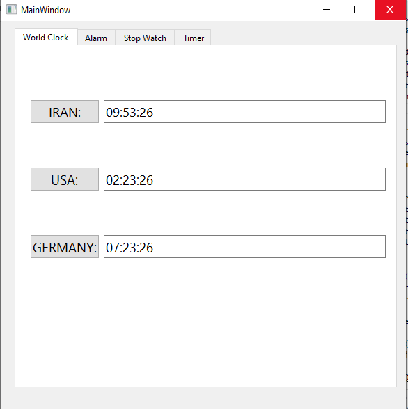
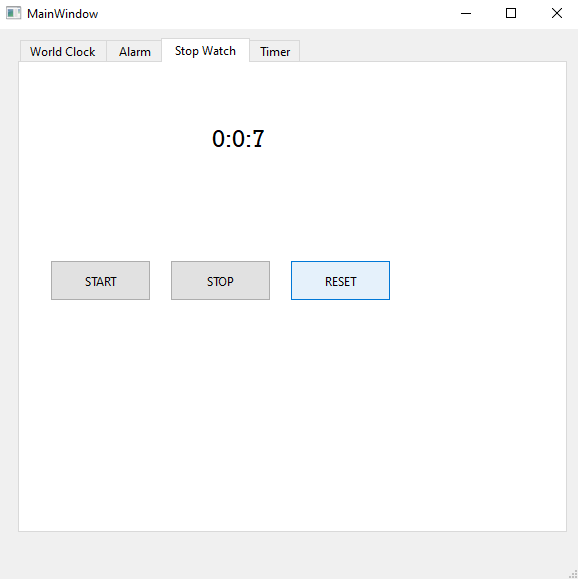
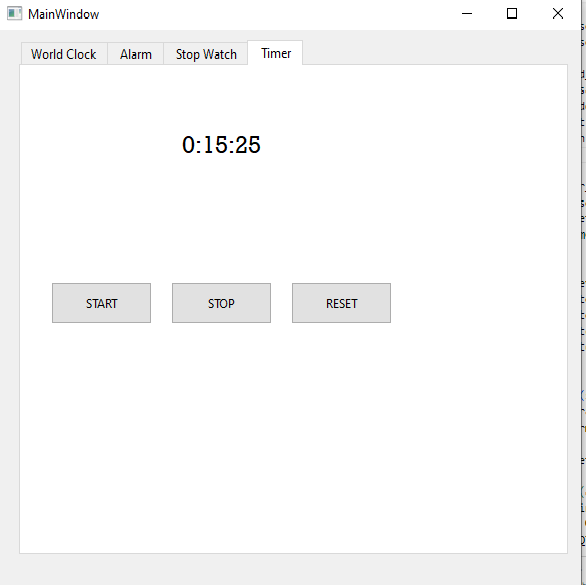
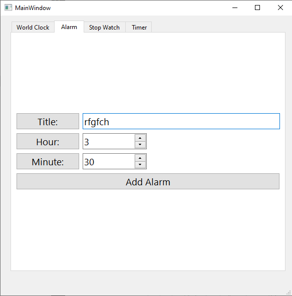

# Clock
Four features, including **alarm**, **clock**, **timer**, and **stopwatch**, can run simultaneously using **Thread** in this program.
## WorldClock
it shows time in three different time zone

## StopWatch

## Timer

## Alarm

